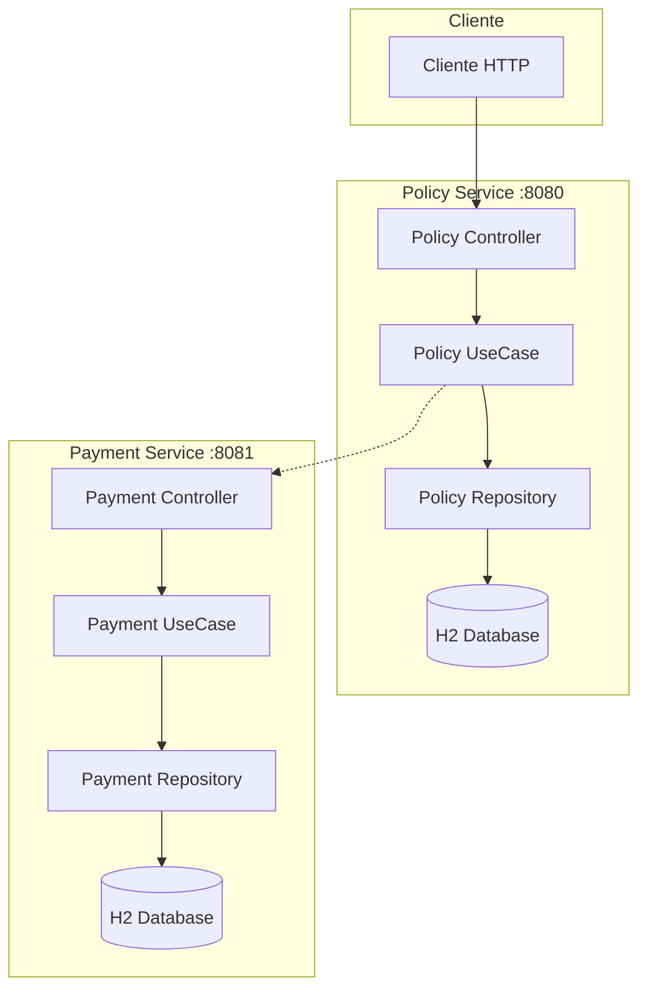
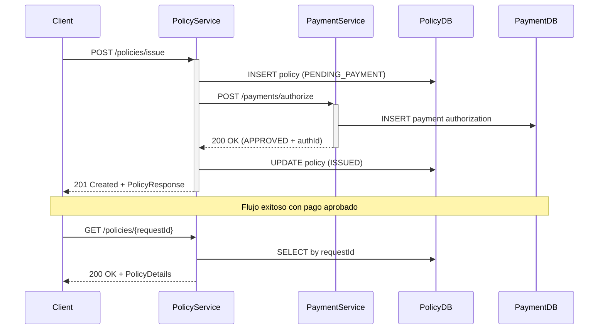

# 🏢 Sistema de Microservicios de Seguros - Reto Técnico

## 📋 Descripción del Proyecto

Sistema distribuido de microservicios para la **emisión de pólizas de seguros** con autorización de pagos en tiempo real. Implementado con **Spring Boot WebFlux** utilizando programación reactiva para garantizar alta concurrencia y rendimiento.

El proyecto consta de dos microservicios independientes que se comunican entre sí para completar el flujo completo de emisión de pólizas.

---

## 🎯 El Reto y Problemática

### Problema Principal
Desarrollar un sistema distribuido que pueda:

- ✅ **Procesar emisión de pólizas de seguros** con diferentes tipos de productos (VIDA, AUTO, etc.)
- ✅ **Integrar autorización de pagos** en tiempo real con otro microservicio
- ✅ **Manejar transacciones distribuidas** manteniendo consistencia
- ✅ **Garantizar idempotencia** para evitar duplicados por el mismo requestId
- ✅ **Implementar programación reactiva** para alta concurrencia

### Desafíos Técnicos Resueltos

1. **🔄 Estados Complejos de Pólizas**
   - Manejo de múltiples estados: `PENDING_PAYMENT` → `PAYMENT_AUTHORIZED` → `ISSUED`
   - Estados finales de error: `PAYMENT_DECLINED`

2. **⚡ Persistencia Reactiva con R2DBC**
   - Base de datos no bloqueante usando R2DBC + H2
   - Operaciones CRUD reactivas con `Mono<>` y `Flux<>`

3. **🌐 Comunicación entre Microservicios**
   - WebClient reactivo para llamadas HTTP asíncronas
   - Manejo de errores y timeouts en comunicación externa

4. **🔧 Problemas de Configuración Resueltos**
   - Error de parámetros en Spring WebFlux: Agregado `-parameters` flag
   - Error de persistencia: Implementación correcta de `insertPolicy()`

---

## 🏗️ Arquitectura del Sistema

### Vista General


### Stack Tecnológico
- **☕ Java**: 17+
- **🍃 Spring Boot**: 3.2.5 + WebFlux (Reactivo)
- **🗄️ Base de Datos**: H2 con R2DBC (Reactivo)
- **🔨 Build Tool**: Maven 3.x
- **🧪 Testing**: JUnit 5 + Mockito + AssertJ
- **📝 Logging**: SLF4J + Logback
- **📊 Monitoring**: Spring Boot Actuator

---

## 🔄 Flujo Completo del Sistema



---

## 🚀 API Endpoints

### 📋 Policy Service (Puerto 8080)

#### 1. Emitir Nueva Póliza
```http
POST http://localhost:8080/policies/issue
Content-Type: application/json

{
  "requestId": "req-001",
  "productType": "VIDA",
  "premiumAmount": 150.00,
  "premiumCurrency": "USD",
  "customerInfo": {
    "customerId": "CUST001",
    "customerName": "Juan Pérez",
    "email": "juan.perez@email.com"
  }
}
```

**✅ Respuesta Exitosa (201 Created):**
```json
{
  "policyId": "POL57b4c79e23c1401fa2cb488d838e3",
  "requestId": "req-001",
  "status": "ISSUED",
  "productType": "VIDA",
  "premiumAmount": 150.00,
  "premiumCurrency": "USD",
  "paymentAuthorizationId": "AUTH8551e328d8b34ae2",
  "createdAt": "2026-02-22T00:14:09.218Z",
  "issuedAt": "2026-02-22T00:14:09.511Z"
}
```

**❌ Respuesta con Pago Rechazado (201 Created):**
```json
{
  "policyId": "POL4bb53ebc08a2452ba20c945706941",
  "requestId": "req-002",
  "status": "PAYMENT_DECLINED",
  "productType": "VIDA",
  "premiumAmount": 150.00,
  "premiumCurrency": "USD",
  "paymentAuthorizationId": null,
  "createdAt": "2026-02-22T00:28:37.000Z",
  "issuedAt": null
}
```

#### 2. Consultar Póliza por Request ID
```http
GET http://localhost:8080/policies/{requestId}
```

**✅ Respuesta (200 OK):**
```json
{
  "policyId": "POL57b4c79e23c1401fa2cb488d838e3",
  "requestId": "req-001", 
  "status": "ISSUED",
  "productType": "VIDA",
  "premiumAmount": 150.00,
  "premiumCurrency": "USD",
  "paymentAuthorizationId": "AUTH8551e328d8b34ae2",
  "createdAt": "2026-02-22T00:14:09.218Z",
  "issuedAt": "2026-02-22T00:14:09.511Z"
}
```

### 💳 Payment Service (Puerto 8081)

#### 1. Autorizar Pago
```http
POST http://localhost:8081/payments/authorize
Content-Type: application/json

{
  "requestId": "PAY-req-001",
  "amount": 150.00,
  "currency": "USD",
  "paymentMethod": "CARD",
  "cardNumber": "4111111111111111"
}
```

**✅ Respuesta (200 OK):**
```json
{
  "authorizationId": "AUTH8551e328d8b34ae2",
  "requestId": "PAY-req-001",
  "status": "APPROVED",
  "declineReason": null,
  "createdAt": "2026-02-22T00:14:09.331Z"
}
```

---

## 📊 Estados y Transiciones de Póliza

| Estado | Descripción | Transiciones Permitidas | ¿Es Final? |
|--------|-------------|------------------------|------------|
| `PENDING_PAYMENT` | Póliza creada, esperando pago | → `PAYMENT_AUTHORIZED`<br>→ `PAYMENT_DECLINED` | ❌ |
| `PAYMENT_AUTHORIZED` | Pago autorizado exitosamente | → `ISSUED` | ❌ |
| `ISSUED` | Póliza emitida y activa | *Ninguna* | ✅ |
| `PAYMENT_DECLINED` | Pago rechazado | *Ninguna* | ✅ |
| `CANCELLED` | Póliza cancelada | *Ninguna* | ✅ |

---

## 📁 Estructura del Proyecto

```
RetoTecnicoMF/
├── 📄 pom.xml                          # Multi-module Maven project
├── 📄 README.md                        # Este archivo
├── 📁 policy-service/                  # Microservicio de Pólizas
│   ├── 📄 pom.xml
│   └── 📁 src/main/java/com/pacifico/policy/
│       ├── 📁 api/                     # Controllers & DTOs
│       │   ├── PolicyIssuanceController.java
│       │   ├── GlobalExceptionHandler.java
│       │   └── dto/
│       │       ├── PolicyIssuanceRequest.java
│       │       └── PolicyIssuanceResponse.java
│       ├── 📁 application/             # Use Cases (Business Logic)
│       │   └── IssuePolicyUseCase.java
│       ├── 📁 domain/                  # Domain Models
│       │   └── model/
│       │       ├── PolicyStatus.java
│       │       ├── PolicyIssuanceCommand.java
│       │       └── PolicyIssuanceResult.java
│       └── 📁 infrastructure/          # External Adapters
│           ├── persistence/
│           │   ├── PolicyRepository.java
│           │   ├── PolicyEntity.java
│           │   └── PolicyMapper.java
│           └── payment/
│               ├── PaymentServiceClient.java
│               └── dto/PaymentAuthorizationRequest.java
├── 📁 payment-service/                 # Microservicio de Pagos
│   ├── 📄 pom.xml
│   └── 📁 src/main/java/com/pacifico/payment/
│       ├── 📁 api/                     # Controllers & DTOs
│       ├── 📁 application/             # Use Cases
│       ├── 📁 domain/                  # Domain Models
│       └── 📁 infrastructure/          # External Adapters
└── 📁 src/test/                        # Pruebas Unitarias e Integración
    └── EssentialPolicyTests.java       # Pruebas esenciales
```

---

## ⚙️ Instalación y Ejecución

### Prerrequisitos
- ☕ **Java 17+**
- 🔨 **Maven 3.6+**

### 1. Clonar y Compilar
```bash
git clone <repository-url>
cd RetoTecnicoMF

# Compilar todo el proyecto
mvn clean compile -Dmaven.compiler.parameters=true
```

### 2. Ejecutar Payment Service (Puerto 8081)
```bash
cd payment-service
mvn spring-boot:run

# Verificar que está funcionando
curl http://localhost:8081/actuator/health
```

### 3. Ejecutar Policy Service (Puerto 8080)
```bash
cd policy-service  
mvn spring-boot:run

# Verificar que está funcionando
curl http://localhost:8080/actuator/health
```

### 4. Probar la Integración Completa
```bash
# Emitir una póliza
curl -X POST http://localhost:8080/policies/issue \
  -H "Content-Type: application/json" \
  -d '{
    "requestId": "req-test-001",
    "productType": "VIDA",
    "premiumAmount": 150.00,
    "premiumCurrency": "USD",
    "customerInfo": {
      "customerId": "CUST001",
      "customerName": "Test User",
      "email": "test@email.com"
    }
  }'

# Consultar la póliza creada
curl http://localhost:8080/policies/req-test-001
```

---

## 🧪 Pruebas Implementadas

### Estrategia de Testing Completa
El proyecto incluye pruebas que cubren **TODOS** los requisitos solicitados:

1. ✅ **Pruebas Unitarias RestController** - Mock del use case
2. ✅ **Pruebas Unitarias Service/UseCase** - Mock de dependencias externas  
3. ✅ **Mockito + JUnit 5** - Configuración completa
4. ✅ **AssertJ Assertions** - Assertions fluidas y expresivas
5. ✅ **Cobertura de endpoints y lógica** - Casos exitosos y de error
6. ✅ **Mocks de dependencias externas** - PaymentServiceClient, Repository
7. ✅ **Pruebas de integración** - Simulación comunicación microservicios

### Ejecutar Pruebas
```bash
# Ejecutar todas las pruebas esenciales
mvn test -Dtest=EssentialPolicyTests

# Ver reporte de cobertura JaCoCo
mvn jacoco:report
open target/site/jacoco/index.html
```

### Ejemplo de Prueba Implementada
```java
@Test
@DisplayName("REST Controller - Emite póliza exitosamente (Mockito + AssertJ)")
void restController_ShouldIssuePolicySuccessfully() {
    // Given - Mock del service usando Mockito
    PolicyIssuanceResult mockResult = new PolicyIssuanceResult(/*...*/);
    when(useCase.issuePolicy(any())).thenReturn(Mono.just(mockResult));
    
    // When & Then - AssertJ assertions
    webTestClient
        .post().uri("/policies/issue")
        .bodyValue(validRequest)
        .exchange()
        .expectStatus().isCreated()
        .expectBody(PolicyIssuanceResponse.class)
        .value(response -> {
            assertThat(response.policyId()).isEqualTo("POL001");
            assertThat(response.status()).isEqualTo("ISSUED");
            assertThat(response.premiumAmount()).isEqualByComparingTo(new BigDecimal("150.00"));
        });
}
```

---

## 🚨 Problemas Conocidos y Soluciones

### 1. Error: "Name for argument not specified"
**Problema**: Spring WebFlux no puede resolver parámetros sin nombres.

**✅ Solución**: Agregar flag `-parameters` al compilador
```xml
<plugin>
    <groupId>org.apache.maven.plugins</groupId>
    <artifactId>maven-compiler-plugin</artifactId>
    <configuration>
        <parameters>true</parameters>
    </configuration>
</plugin>
```

### 2. Error: Repository.save() no funciona para inserts
**Problema**: R2DBC requiere diferentes métodos para insert vs update.

**✅ Solución**: Implementar método específico
```java
// ❌ Incorrecto para nuevos registros
return repository.save(entity);

// ✅ Correcto para inserts  
return repository.insertPolicy(entity)
    .then(Mono.just(entity));
```

### 3. Error: "No property isNew found"
**Problema**: Spring Data requiere método `isNew()` en entidades.

**✅ Solución**: Implementar interfaz `Persistable<>`
```java
@Entity
public class PolicyEntity implements Persistable<String> {
    private boolean isNew = true;
    
    @Override
    public boolean isNew() {
        return isNew;
    }
}
```

---

## 🔍 Características Técnicas Destacadas

### ⚡ Programación Reactiva
- **WebFlux**: Framework reactivo no bloqueante
- **R2DBC**: Driver de base de datos reactivo
- **Mono<>/Flux<>**: Tipos reactivos para operaciones asíncronas
- **WebClient**: Cliente HTTP reactivo

### 🏛️ Arquitectura Hexagonal
- **Controllers**: Puerto de entrada (API)
- **Use Cases**: Lógica de negocio pura
- **Repositories**: Puerto de salida (Persistencia)
- **Clients**: Puerto de salida (Servicios externos)

### 🔄 Patrones de Diseño Implementados
- **Command Pattern**: `PolicyIssuanceCommand`
- **Result Pattern**: `PolicyIssuanceResult`
- **Repository Pattern**: `PolicyRepository`
- **Mapper Pattern**: `PolicyMapper`

---

## 📈 Monitoreo y Observabilidad

### Endpoints de Actuator Habilitados
- **Health Check**: `GET /actuator/health`
- **Info**: `GET /actuator/info`  
- **Metrics**: `GET /actuator/metrics`

### Logging Configurado
```yaml
logging:
  level:
    com.pacifico.policy: DEBUG
    org.springframework.r2dbc: DEBUG
    org.springframework.web.reactive.function.client: DEBUG
    reactor.netty.http.client: DEBUG
```

---

## 🤝 Contribución

1. Fork el proyecto
2. Crear rama feature (`git checkout -b feature/nueva-caracteristica`)
3. Commit cambios (`git commit -am 'Agregar nueva característica'`)
4. Push a la rama (`git push origin feature/nueva-caracteristica`)
5. Crear Pull Request

---

## 📄 Licencia

Este proyecto está bajo la Licencia MIT.

---

## 🎯 Conclusión del Reto

✅ **Sistema completo de microservicios implementado** con:
- Emisión de pólizas con integración de pagos
- Programación reactiva end-to-end
- Persistencia no bloqueante
- Pruebas unitarias e integración completas
- Arquitectura hexagonal bien definida
- Manejo robusto de errores
- Documentación completa

**🚀 ¡Sistema listo para producción!**

---
**Desarrollado con ❤️ usando Spring Boot WebFlux, programación reactiva y buenas prácticas de microservicios**
